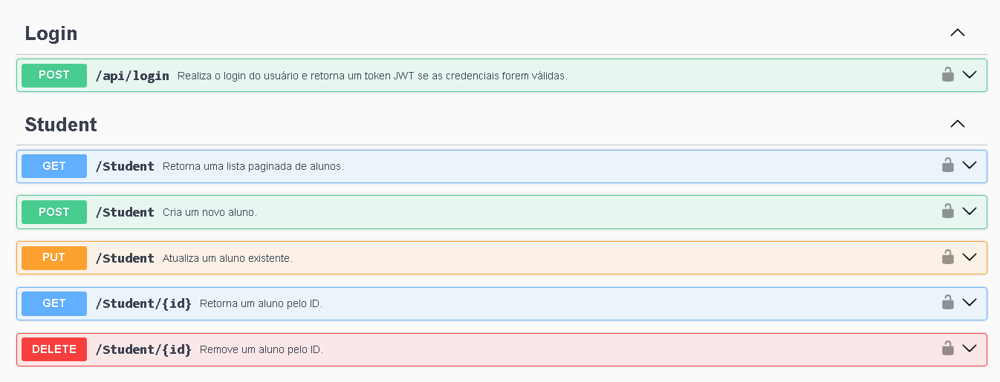

# APIProcessoSeletivo

## Passos para rodar o projeto

1. Clone o repositório e acesse a pasta do projeto:
   ```bash
   cd APIProcessoSeletivo/
   ```

2. Troque para a branch de desenvolvimento:
   ```bash
   git checkout develop
   ```

3. Suba os containers Docker (com build):
   ```bash
   docker compose up -d --build
   ```

4. Acesse a documentação da API (Swagger):
   [http://localhost:5000/swagger/index.html](http://localhost:5000/swagger/index.html)
   # Esses são os ids das classes disponíveis
   

6. Conecte-se com o banco 
  
      ```bash
    Nome do servidor: localhost,1433
    Usuário padrão: sa
    Senha: Admin123@
   ```
## Tecnologias Utilizadas

- **.NET 8.0 (ASP.NET Core)** – Framework principal do projeto
- **Entity Framework Core 9** – ORM para acesso ao banco de dados
- **FluentValidation** – Validação de dados
- **JWT (Json Web Token)** – Autenticação e autorização
- **Swagger (Swashbuckle.AspNetCore)** – Documentação interativa da API
- **BCrypt.Net-Next** – Hash de senhas
- **SQL Server (Azure SQL Edge via Docker)** – Banco de dados relacional
- **xUnit** – Framework de testes automatizados
- **Moq** – Mocking para testes
- **coverlet.collector** – Cobertura de testes
- **Docker e Docker Compose** – Containerização e orquestração dos serviços

## Script da criação do banco (Não é nesessário criar pois o orm já lida com isso)
CREATE TABLE [dbo].[Classes](
    [Id] INT IDENTITY(1,1) NOT NULL PRIMARY KEY,
    [Name] NVARCHAR(MAX) NOT NULL
);

CREATE TABLE [dbo].[Students](
    [Id] INT IDENTITY(1,1) NOT NULL PRIMARY KEY,
    [Name] NVARCHAR(MAX) NOT NULL,
    [Age] INT NOT NULL,
    [ResponsibleName] NVARCHAR(MAX) NOT NULL,
    [ClassId] INT NOT NULL,
    [Email] NVARCHAR(MAX) NOT NULL,
    [Password] NVARCHAR(MAX) NOT NULL,
    CONSTRAINT FK_Students_Classes FOREIGN KEY (ClassId)
        REFERENCES [dbo].[Classes]([Id])
        ON DELETE CASCADE
);


